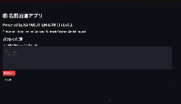

# KARAKURI LM 8x7B Chat v0.1 



ここのフォルダでは、KARAKURI LM 8x7B Chat v0.1 を Custom Model Import して使う例を示しています。  

## 実行環境

- SageMaker Studio Code Editor (Image: SageMaker Distribution 2.0.0)
- ストレージ: 512GB

必要な権限
- IAM Role の作成・ポリシーのアタッチをする権限
- モデルの重みを格納する S3 バケットへ書き込み権限（AmazonS3FullAccess など）
- Bedrock への FullAccess（AmazonBedrockFullAccess など）

IAM の作成・ポリシーアタッチに関するポリシー例
```json
{
	"Version": "2012-10-17",
	"Statement": [
		{
			"Sid": "VisualEditor0",
			"Effect": "Allow",
			"Action": [
				"iam:CreatePolicy",
				"iam:CreateRole",
				"iam:AttachRolePolicy"
			],
			"Resource": [
				"arn:aws:iam::<aws_account_id>:role/bedrock-cmi*",
				"arn:aws:iam::<aws_account_id>:policy/bedrock-cmi*"
			]
		}
	]
}
```

## setup

git lfs のインストール
```sh
# Ubuntu/Debian の場合
sudo apt-get install git-lfs
# MacOS の場合
brew install git-lfs
```

Python の仮想環境の構築
```sh
python -m venv .venv 
source .venv/bin/activate
pip install -r requirements.txt
```

他に準備するリソース
- データをアップロードするための S3 バケット（Custom Model Import を実施するリージョンと同じにしてください）


## 手順

### Model ダウンロードと Model Import. 

モデルを HuggingFace hub からダンロードし、S3 へアップロードします。  
モデルサイズが大きいため、１時間以上かかります。  
```sh
# 必要情報を指示に従って入力する
./download.sh
```

import したモデルの ARN がメッセージに表示されるので、それをメモしておく。  


### Import したモデルの使用

シンプルに呼び出す

```sh
python call_imported_model.py --model-arn <メモした ARN>
```

Streamlit でのサンプルアプリのホスト

```sh
streamlit run app.py -- --model-arn <メモした ARN>
```
Code Editor の場合、pinggy と呼ばれるサービスを利用することでホストされた UI を確かめることができます。  
うまくいけば HTTP/HTTPS から始まる URL が表示されます。https:// から始まる URL をコピーし、ウェブブラウザの別タブを開き、URL バーに貼り付けて移動してください。  
```sh
ssh -p 443 -R0:localhost:8501 a.pinggy.io
```

例えば、下記の名前一覧を貼り付けて抽選をさせてみましょう。  

```text
霧島 虹輝（きりしま にじき）
星野 天馬（ほしの てんま）
月代 詩音（つきしろ しおん）
雪花 璃子（ゆきはな りこ）
鳳凰院 清明（ほうおういん きよあき）
風祭 藍空（かざまつり あいく）
桜庭 麗華（さくらば れいか）
翠川 遥斗（みどりかわ はると）
紫電 征真（しでん せいま）
空咲 和泉（そらさき いずみ）
朝霧 双葉（あさぎり ふたば）
綺羅 心愛（きら ここあ）
氷室 蒼太（ひむろ そうた）
神無月 陽炎（かんなづき かれん）
天城 響介（あまぎ きょうすけ）
月夜野 詩織（つよの しおり）
霊峰 一颯（れいほう いぶき）
稲妻 蓮華（いなづま れんげ）
夢咲 あおい（ゆめさき あおい）
鳳仙 光輝（ほうせん こうき）
雪代 美結（ゆきしろ みゆ）
紅葉院 慧（もみじいん けい）
瑠璃川 翔（るりかわ しょう）
天羽 望海（あまば のぞみ）
氷雨 京子（ひさめ きょうこ）
緋色 真虎（ひいろ まとら）
日和 奏多（ひより かなた）
夜見 月詠（よみ つかよみ）
幻影 碧（げんえい あおい）
神楽坂 銀河（かぐらざか ぎんが）
白銀 朔夜（しろがね さくや）
蒼月 零士（そうげつ れいじ）
竜胆 凛（りんどう りん）
花園 天音（はなぞの あまね）
葵川 海斗（あおいかわ かいと）
深淵 玲奈（しんえん れいな）
幽谷 睦月（かげたに むつき）
天宮 瑠璃（あまみや るり）
翡翠 颯斗（ひすい はやと）
紫苑 千代（しおん ちよ）
月影 結衣（つきかげ ゆい）
虹ノ原 詩歩（にじのはら しほ）
蒼空 陽翔（そらいろ はると）
雪村 心春（ゆきむら こはる）
朱雀院 蓮（すざくいん れん）
碧波 海音（へきは かのん）
夢咲 明日香（ゆめさき あすか）
紅葉谷 涼（もみじたに りょう）
天城 燈（あまぎ あかり）
銀河 星渚（ぎんが せいな）
```

